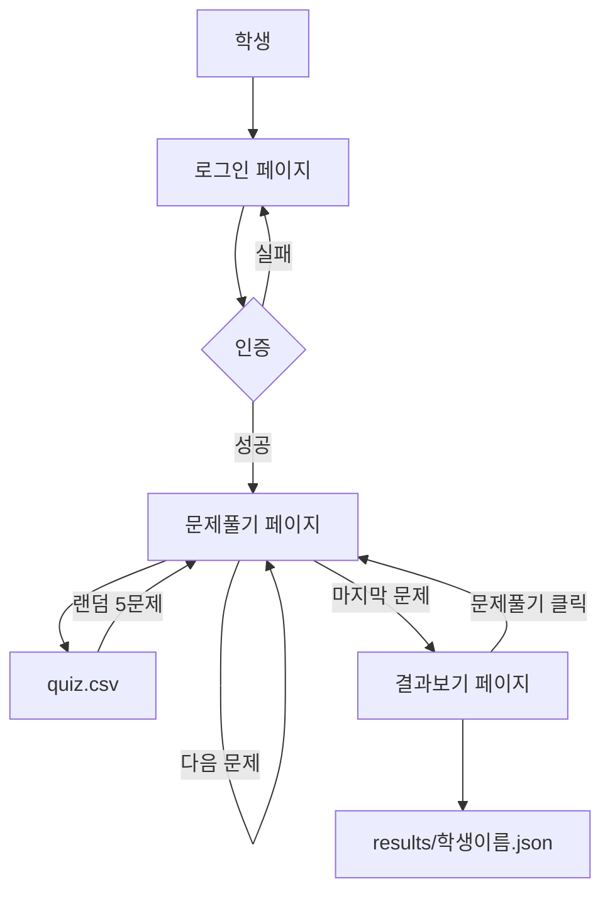

# PDFtoQuiz 웹 애플리케이션 개발 계획서

## 1. 프로젝트 개요

Flask 기반의 퀴즈 학습 관리 시스템으로, 학생들이 로그인하여 랜덤 문제를 풀고 결과를 확인할 수 있는 로컬 서비스입니다.

## 2. 시스템 아키텍처



## 3. 기술 스택

- **Backend**: Python Flask
- **Frontend**: HTML, CSS, JavaScript, Bootstrap 5
- **Database**: SQLite3 (회원 관리)
- **Data Storage**: CSV (문제), JSON (결과)
- **환경**: Local 서비스

## 4. 디렉토리 구조

```
PDFtoQuiz/
├── app.py                 # Flask 메인 애플리케이션
├── database.db           # SQLite 회원 DB
├── quiz/
│   └── quiz.csv         # 문제 데이터 (기존 파일)
├── results/             # 학생별 결과 JSON 저장
├── templates/
│   ├── login.html       # 로그인 페이지
│   ├── quiz.html        # 문제풀기 페이지
│   └── result.html      # 결과보기 페이지
└── static/
    ├── css/
    │   └── style.css    # 커스텀 스타일
    └── js/
        └── quiz.js      # 문제풀기 로직
```

## 5. 데이터베이스 설계

### users 테이블

```sql
CREATE TABLE users (
    id INTEGER PRIMARY KEY AUTOINCREMENT,
    username TEXT UNIQUE NOT NULL,
    password TEXT NOT NULL
);

-- 테스트 계정
INSERT INTO users (username, password) VALUES ('홍길동', '1111');
```

## 6. 데이터 구조

### quiz.csv 구조

- Question, Example_A, Example_B, Example_C, Example_D, Answer, Explanation

### 결과 JSON 구조 (results/홍길동.json)

```json
{
  "username": "홍길동",
  "attempts": [
    {
      "date": "2026-01-29",
      "time": "14:30:25",
      "score": 4,
      "total": 5,
      "details": [
        {
          "question_num": 1,
          "question_id": 15,
          "correct": true
        },
        {
          "question_num": 2,
          "question_id": 7,
          "correct": false
        }
      ]
    }
  ]
}
```

## 7. 주요 기능 상세

### 7.1 로그인 페이지 (`/`)

- **UI 요소**: 이름 입력, 비밀번호 입력, 로그인 버튼
- **기능**: 
  - SQLite DB에서 사용자 인증
  - 세션 생성 (Flask session)
  - 인증 실패 시 에러 메시지 표시
  - 인증 성공 시 `/quiz` 페이지로 리다이렉트

### 7.2 문제풀기 페이지 (`/quiz`)

- **세션 체크**: 로그인 여부 확인 (미로그인 시 로그인 페이지로 리다이렉트)
- **문제 출제 로직**:
  - quiz.csv에서 5문제를 랜덤 추출 (중복 없음)
  - 세션에 문제 ID 리스트 저장
  - 1문제씩 순차 표시
- **UI 요소**:
  - 문제 번호 표시 (예: 문제 1/5)
  - 문제 내용
  - 4개의 객관식 보기 (라디오 버튼)
  - "다음 문제" 버튼 (1~4번) / "결과보기" 버튼 (5번)
- **상태 관리**:
  - JavaScript로 클라이언트 측에서 답안 임시 저장
  - 다음 문제 클릭 시 답안을 배열에 추가
  - 마지막 문제 후 전체 답안을 서버에 POST

### 7.3 결과보기 페이지 (`/result`)

- **데이터 처리**:
  - POST 요청으로 학생 답안 수신
  - quiz.csv에서 정답 확인
  - 채점 후 results/학생이름.json에 저장 (추가 모드)
  - 기존 파일이 있으면 attempts 배열에 추가
- **UI 표시**:
  - **상단**: 점수 요약 (예: "총점: 4점 / 5점")
  - **중단**: 문제별 상세 결과
    - 문제 내용
    - 학생이 선택한 답
    - 정답
    - 해설
    - 정답/오답 표시 (색상 구분)
  - **과거 기록**: 이전 시도 기록을 날짜별로 표시
  - **하단**: "문제풀기" 버튼 (클릭 시 `/quiz`로 리다이렉트)

## 8. Flask 라우트 설계

```python
@app.route('/')               # GET: 로그인 페이지
@app.route('/login', methods=['POST'])  # POST: 로그인 처리
@app.route('/quiz')           # GET: 문제풀기 페이지
@app.route('/submit', methods=['POST']) # POST: 답안 제출
@app.route('/result')         # GET: 결과보기 페이지
@app.route('/logout')         # GET: 로그아웃
```

## 9. 주요 정책

| 항목 | 내용 |
|------|------|
| 서비스 운영 | Local |
| 1회 출제 수 | 5문제 |
| 문제 표시 방식 | 1문제씩 순차 표시 |
| 문제 선택 | 완전 랜덤 (중복 없음) |
| 결과 저장 | Overwrite 없이 추가 (attempts 배열) |
| 비밀번호 | 평문 저장 (테스트용) |
| 세션 관리 | Flask session |

## 10. 보안 고려사항

- 테스트용이므로 비밀번호 평문 저장
- Flask secret_key 설정 필요
- 세션 기반 인증 체크

## 11. 개발 순서

1. Flask 앱 기본 구조 및 SQLite DB 초기화
2. 로그인 페이지 및 인증 로직 구현
3. 문제풀기 페이지 (CSV 읽기, 랜덤 선택, UI)
4. 결과 저장 및 결과보기 페이지
5. 스타일링 및 UX 개선
6. 통합 테스트

## 12. 필요 패키지

```txt
Flask==3.0.0
pandas==2.1.4
```

## 13. 실행 방법

```bash
python app.py
# 브라우저에서 http://localhost:5000 접속
```

## 14. 테스트 계정

- 아이디: `홍길동`
- 비밀번호: `1111`
